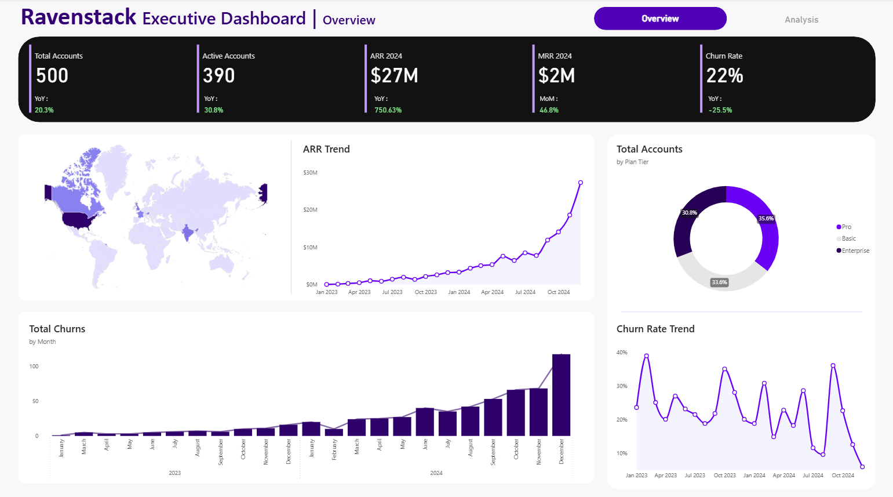
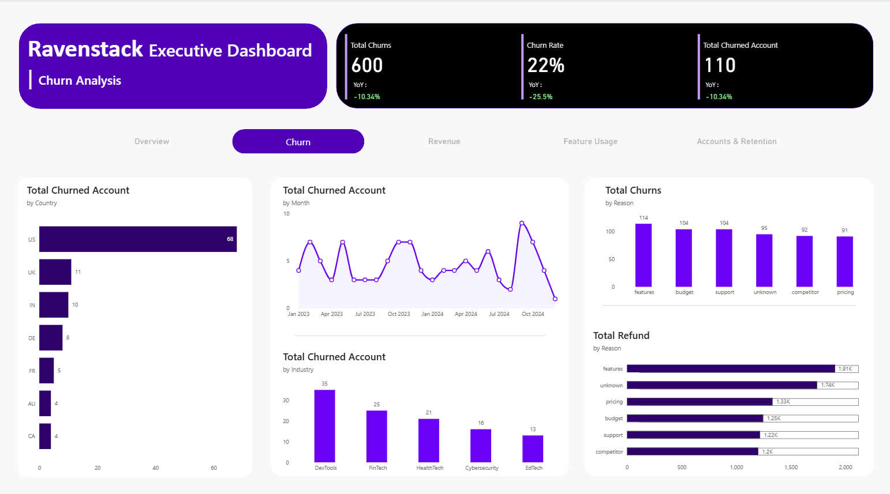

# Ravenstack Executive Dashboard

An interactive executive dashboard built as a portfolio project to showcase my data analysis and visualization skills using Power BI.

---

## Project Overview

**Ravenstack** is a fictional SaaS company. This dashboard is designed for executive stakeholders to monitor business health and make data-driven decisions based on:

- **Churn Analysis**
- **Revenue Performance**
- **Account & Retention Trends**
- **Feature Usage Patterns**

The project uses **Power BI** with layered interactivity, dynamic tooltips, and clean design principles to emulate real-world business intelligence tools used by product, finance, and customer success teams.

---

## Dashboard Sections

### Overview
- Key KPIs: Total Accounts, Active Accounts, ARR ($27M), MRR ($2M), Churn Rate (22%)
- Year-over-year and month-over-month performance
- Churn trend and ARR growth visuals

### Churn Analysis
- Churn by **reason**, **country**, **industry**, and **month**
- Refund loss by churn reason 
- Total churns vs churned accounts
- YoY churn improvements

### Revenue Analysis
- ARR & MRR growth breakdown
- Upgrade vs downgrade ARR
- Revenue by **country** and **industry**
- Monthly performance tracking

### Feature Usage
- Feature usage count & error rates
- Beta feature adoption by industry
- Total usage duration by plan tier

### Accounts & Retention
- Accounts by country, plan tier, and usage duration
- Trial account funnel breakdown
- Seat allocation by industry

---

## Notable Features

**Dynamic Tooltips**:  
Insight-rich tooltips added throughout for seamless user understanding without clutter.

**Interactive Tabs**:  
Segmented dashboards replicate professional BI navigation workflows.

**Brand-consistent Styling**:  
Purple/black theme maintained across all visuals with thoughtful color hierarchy.

**Real-World SaaS Metrics**:  
Focus on actionable KPIs commonly tracked by SaaS companies.

---

## Tools & Tech

| Tool       | Purpose                     |
|------------|-----------------------------|
| Power BI   | Data modeling, dashboarding |
| DAX        | KPIs, measures, calculations|
| Excel/CSV  | Data simulation and cleanup |

---

## Preview

  
  

---

